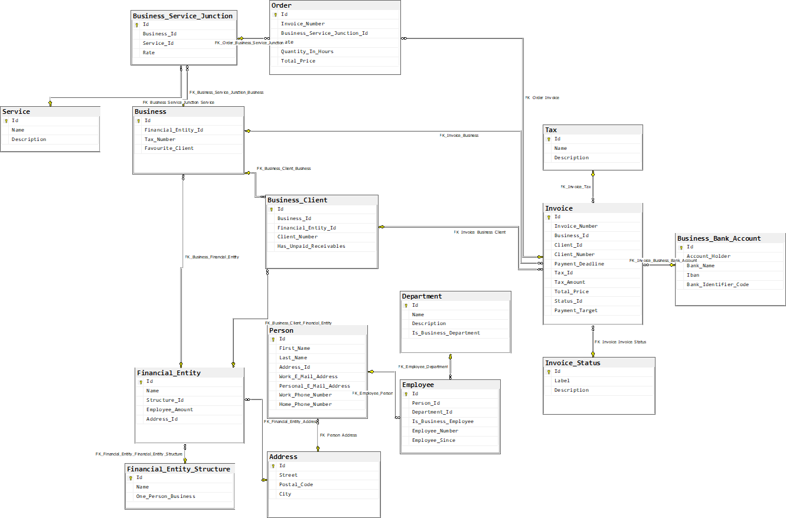

# Projektbeschreibung Gruppe E: Rechnungsprogramm

- Ausschließlich für und mit SQL Server 2019 entwickelt

## Businesslogik

- Das Hauptprodukt ist eine Software, die es Kunden ermöglicht,
Rechnungen zu erstellen. Die durch die Software generierten Rechnungen beinhalten verschiedene Eingabeparameter wie das Datum der erbrachten Leistung, den Fälligkeitszeitpunkt, erbrachte Leistungen,
Einzelpreise pro Leistung, Rechnungsnummer, Kundendaten, Gesamtbetrag, Zahlungsdetails und das Erstellungsdatum.
- Die Software verfügt über ein Erinnerungssystem, das ausgelöst wird,
wenn eine Rechnung nach 14 Tagen unbezahlt bleibt. Die Fälligkeitsfrist für die Zahlung kann über diesen Zeitraum hinaus eingestellt
werden, allerdings nur einmal. Für effiziente Kommunikation bei Erinnerungen und Mahnungen stehen Vorlagen zur Verfügung.
- Kunden haben die Möglichkeit, bevorzugte Auftraggeber zu bestimmen, was zur Erstellung spezifischer Rechnungsvorlagen für diese häufig bearbeiteten Kunden führt.

## Design

